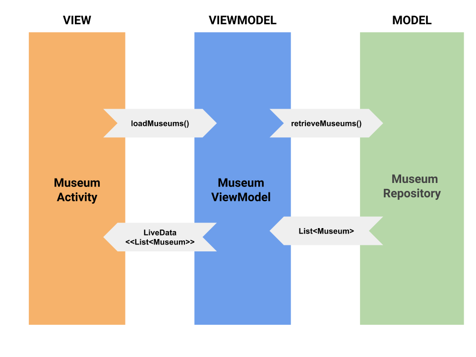

# xingyu_kotlin_mvvm

MVVM(Model View ViewModel) sample in Kotlin using the components ViewModel, LiveData, the libraries Retrofit, Glide and Mockito for testing.

### MVVM Pattern (Model View ViewModel)
 

### Architecture

### Flow

 

### Slides

Android MVVM https://docs.google.com/presentation/d/1nTwtU8OWYs_8Q3i_3hOPAWodDpDKzO--uA-4b6LUr8g/edit?usp=sharing

### References

- ViewModel https://developer.android.com/topic/libraries/architecture/viewmodel
- LiveData https://developer.android.com/topic/libraries/architecture/livedata
- MVVMSample https://github.com/ravi123shanker/kotlin-mvvm-sample
